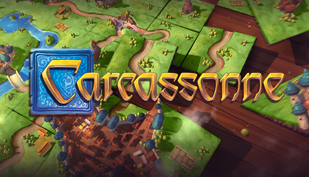

# Carcassonne

Carcassonne is a game about connecting tiles to form larger structures, and strategically 
placing your followers to score the most points. Inspired by the medieval french city of carcassonne,
the players take turns placing tiles consisting of roads, fields, cities, and monasteries - creating 
the french countryside around the city. 
When every tile is spent, the player with the most points wins.

Demo video: 
https://youtu.be/29w5szNviCU

# Rules

## Turns

Each turn consists of two phases:

### Tile placement
Tiles can only be placed so that the edges are adjacent to terrains of the same type. 
Meaning roads (grey tiles) have to extend roads, cities (orange tiles) extend cities and fields (green tiles) extend fields. 
Monasteries are shown as red tiles, but are alway surrounded by other tiles - so we don't have to consider adjacency when placing them.
Tiles have to be placed adjacent to at least one other tile.

### Place meeple / end turn
In the second phase of your turn, you can place a "meeple" - a follower - on one of the terrain types
of the tile you just placed. When a feature is completed, the player with the most meeples (or the player
in turn, if they have an equal amount) on a connected terrain feature gets the points for completing that feature.

But plan well! Each player has only seven meeples. You get them back when a feature is completed, but if
you wager too many on a single feature, you might miss out on points if you can't complete it!

When you end your turn, the board is scanned for features completed during your turn. Points are assigned accordingly, 
and meeples are returned to their player. Cities are completed if they are surrounded on all edges by other terrains. 
Roads are completed if they form a loop, and monasteries are completed when they are surrounded by eight full tiles.

## Scoring

In this (slightly simplified) version of the game, all points are assigned on feature completion.  
Completed cities give 2 points per tile, roads score one point per tile, and monasteries score one point per 
surrounding tile plus four. 

## Controls
This implementation of the game is designed with two players in mind, as they would have to play on the same computer. Therefore, we have duplicate controls in case one player wants to play using WASD/touchpad while the other uses arrowkeys/mouse.

W / Up-arrow : move tile upwards.  
A / Left-arrow : move tile left.  
S / Down-arrow : move tile down.  
D / Right-arrow : move tile right.  
  
R / Backspace : Rotate tile.  
Spacebar / Enter : Place tile.  